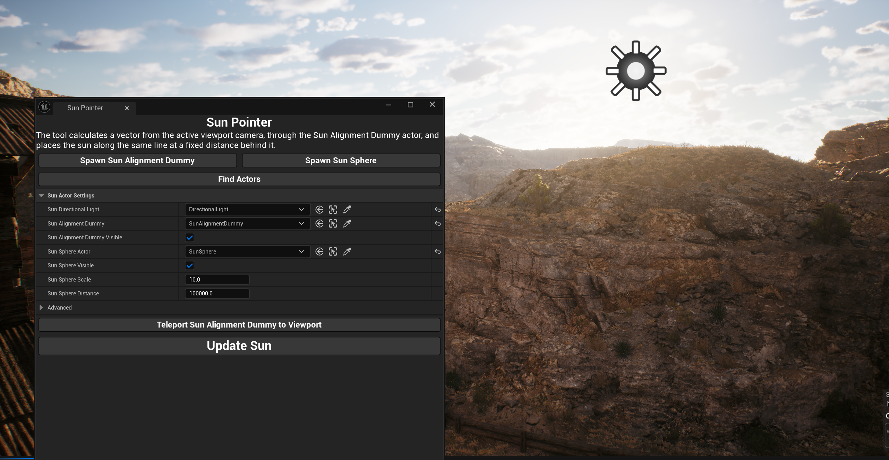

# Sun Pointer 

**Sun Pointer** is a UX-driven Unreal Engine utility designed to eliminate the technical friction of scene lighting. Instead of relying on manual rotation values or directional gizmos, Sun Pointer allows lighting artists to position the sun visually by "pointing" exactly where the light should originate from a specific vantage point. This tool significantly accelerates the iteration speed of Lighting Supervisors and Environment Artists, transforming "hero shot" lighting into an intuitive, perspective-based process.

## 🚀 The Concept

Traditional lighting setups in 3D space often involve a "trial and error" loop; adjusting rotational gizmos or sliders, checking the viewport, and re-adjusting until the shadows hit a specific mark. This disconnected process slows down iteration, especially when trying to hit a specific "hero" angle. Sun Pointer solves this by leveraging vector-based alignment, allowing artists to set light trajectory directly from their perspective, turning a technical task into a creative, visual one.

---

## ✨ Key Features

* **Perspective-Driven Alignment:** Calculates a vector from the active viewport camera through a target dummy to automate Directional Light rotation.
* **Scene-Wide Actor Synchronization:** A single-click "Find Actors" function audits the scene to automatically link lights, sky spheres, and alignment targets.
* **Contextual Asset Deployment:** Features a "Teleport" function to instantly bring the alignment dummy into the artist's current field of view, regardless of world scale.
* **Global Visibility Management:** Integrated UI toggles allow for instant cleanup of helper assets, ensuring the viewport remains optimized for artistic review.
* **Configurable World-Scale Alignment:** Provides granular control over Sun Sphere scale and distance parameters, ensuring the tool’s visual guides remain compatible with the project’s specific atmospheric far-clip planes and world units.

---

## 📖 Quick Start Guide

If you are setting up Sun Pointer for the first time in a level:

1.  **Launch the Tool:** Right-click `EUW_SunPointer` in your Content Browser and select **Run Editor Utility Widget**.
2.  **Spawn Assets:** Click **Spawn Sun Alignment Dummy** and **Spawn Sun Sphere** to add the necessary actors to your Outliner.
3.  **Link Your Scene:** Click **Find Actors**. The tool will automatically populate the Directional Light, Sun Sphere, and Dummy fields.
4.  **Position the Sun:**
    * Fly your viewport camera to your desired vantage point.
    * Click **Teleport Sun Alignment Dummy to Viewport** to bring the target into view.
    * Move the Dummy actor (the sun icon) to the specific spot in the sky where you want the sun.
5.  **Sync:** Hit **Update Sun**. Your light will instantly rotate to match the trajectory from your camera through the dummy.

---

## 🛠 UI Overview

| Button / Field | Function |
| :--- | :--- |
| **Find Actors** | Automatically hooks up the tool to existing light and dummy actors in the scene. |
| **Teleport Dummy** | Snaps the alignment target to a fixed distance in front of your current viewport camera. |
| **Update Sun** | Executes the vector math and snaps the Directional Light and Sun Sphere into alignment. |
| **Visibility Checkboxes** | Hides/Shows the tool's helper actors for a clean final look. |

---

## 📦 Installation

1.  Download the repository and extract the files.
2.  Copy the `SunPointer` sub-folder (the one containing the .uplugin file) into your project's `Plugins` directory.
3.  Restart Unreal Engine.
4.  Enable **Show Plugin Content** in your Content Browser settings to locate the widget.
5.  Developed and tested for Unreal Engine 5.7.

---

## 🤝 Contributing
Sun Pointer was built to streamline the environment art workflow. If you have ideas for improvements, new features, or find a bug, please open an issue or submit a pull request!
